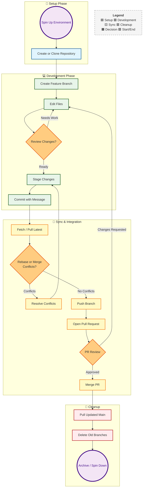
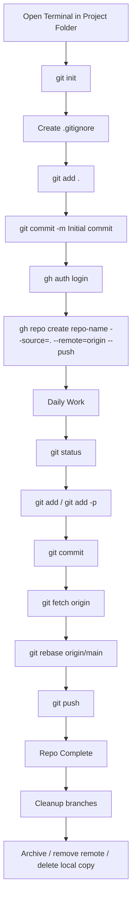

# Git Gud

A practical, terminal-first Git reference you can use as a quick professional guide.

---

# Git mental model

Git has four main states:

* **Working directory**: your current files
* **Staging area**: what goes into the next commit
* **Local repository**: your local commit history
* **Remote repository**: shared history on GitHub/GitLab/etc.

The professional habit is simple:

**check → review → stage → commit → sync → push**

---

# Repository lifecycle at a glance



---

# 1) Spin up a repository

## Create a brand new local repo

```bash
mkdir my-project
cd my-project
git init
git branch -M main
```

## Add files and make the first commit

```bash
git add .
git commit -m "Initial commit"
```

## Add a remote and push

```bash
git remote add origin git@github.com:username/repo-name.git
git push -u origin main
```

## Clone an existing repo

```bash
git clone git@github.com:username/repo-name.git
cd repo-name
```

---

# 2) Auto-pilot: create and maintain a repo entirely from the terminal

This section is the closest thing to a clean terminal-only workflow for spinning up and maintaining a repo professionally.

## A. First-time machine setup

### Verify Git and GitHub CLI

```bash
git --version
gh --version
```

### Set your Git identity

```bash
git config --global user.name "Your Name"
git config --global user.email "you@example.com"
```

### Set a few sane defaults

```bash
git config --global init.defaultBranch main
git config --global pull.rebase true
git config --global fetch.prune true
git config --global rebase.autoStash true
git config --global push.default simple
```

### Check your configuration

```bash
git config --global --list
```

### Authenticate GitHub CLI

```bash
gh auth login
gh auth status
```

---

## B. Auto-pilot: create a new repo from an existing project folder

Go into your project directory:

```bash
cd /path/to/your/project
```

Initialize Git:

```bash
git init
git branch -M main
```

Create a `.gitignore`:

```bash
nano .gitignore
```

Example `.gitignore` starter:

```gitignore
__pycache__/
*.pyc
.venv/
.env
.DS_Store
.vscode/
.idea/
dist/
build/
*.log
```

Check what files exist:

```bash
git status -u
```

Stage and commit:

```bash
git add .
git commit -m "v0.1 initial project scaffold"
```

Create the GitHub repo from the terminal and push in one step:

```bash
gh repo create repo-name --private --source=. --remote=origin --push
```

Check the remote:

```bash
git remote -v
```

That is the cleanest terminal-only path.

---

## C. Auto-pilot: if the GitHub repo already exists

Initialize locally:

```bash
git init
git branch -M main
```

Add files:

```bash
git add .
git commit -m "Initial commit"
```

Add the remote manually:

```bash
git remote add origin git@github.com:username/repo-name.git
```

Verify:

```bash
git remote -v
```

Push:

```bash
git push -u origin main
```

---

## D. Auto-pilot: daily maintenance flow

This is the professional terminal habit loop:

```bash
git status -sb
git diff
git add -p
git commit -m "feat: describe change"
git fetch origin
git rebase origin/main
git push
```

If working directly on `main` in a solo repo, the loop is usually:

```bash
git status -sb
git add .
git commit -m "Describe update"
git pull --rebase
git push
```

---

## E. Auto-pilot: start a feature branch and keep it healthy

Create and switch:

```bash
git switch -c feature/my-change
```

Work normally:

```bash
git status -sb
git add -p
git commit -m "feat: add my change"
```

Sync with latest `main`:

```bash
git fetch origin
git rebase origin/main
```

Push branch:

```bash
git push -u origin feature/my-change
```

After merge, clean up:

```bash
git switch main
git pull --rebase
git branch -d feature/my-change
git push origin --delete feature/my-change
```

---

## F. Auto-pilot: repo shutdown / spin-down

If the repo is done and you want to clean it up:

### Clean merged local branches

```bash
git switch main
git pull --rebase
git branch --merged
git branch -d branch-name
```

### Remove stale remote-tracking refs

```bash
git fetch --prune
```

### Detach local folder from GitHub remote

```bash
git remote remove origin
```

### Remove Git tracking entirely but keep files

```bash
rm -rf .git
```

### Delete the local repo folder entirely

```bash
cd ..
rm -rf repo-name
```

---

# 3) Professional command flow: spinning up, maintaining, and spinning down a repository



---

# 4) Core everyday commands

## Status and inspection

```bash
git status
git status -sb
git remote -v
git branch
git branch -vv
```

## Review changes

```bash
git diff
git diff --staged
git show
```

## Stage files

```bash
git add .
git add FILE
git add -p
git restore --staged FILE
```

## Commit changes

```bash
git commit -m "Short message"
git commit
git commit --amend
```

## Push and pull

```bash
git pull --rebase
git push
git push -u origin main
```

## Fetch without changing your branch

```bash
git fetch origin
git fetch --all --prune
```

---

# 5) Branching

## Create and switch branch

```bash
git switch -c feature/new-work
```

## Switch branches

```bash
git switch main
git switch feature/new-work
```

## List branches

```bash
git branch
git branch -a
git branch -vv
```

## Rename current branch

```bash
git branch -M main
```

## Delete a branch

```bash
git branch -d feature/new-work
git branch -D feature/new-work
```

---

# 6) History and investigation

## Compact history

```bash
git log --oneline --decorate --graph --all
```

## Show recent commits

```bash
git log -n 10
```

## Show one commit

```bash
git show <commit>
```

## See who changed a file

```bash
git blame path/to/file
```

---

# 7) Undo and recovery

## Discard unstaged changes

```bash
git restore FILE
git restore .
```

## Unstage without deleting work

```bash
git restore --staged FILE
git restore --staged .
```

## Revert with a new commit

```bash
git revert <commit>
```

## Reset local history

```bash
git reset --soft HEAD~1
git reset --mixed HEAD~1
git reset --hard HEAD~1
```

## Recover lost work

```bash
git reflog
```

---

# 8) Rebase, merge, and sync

## Preferred professional sync pattern

```bash
git fetch origin
git rebase origin/main
```

## Merge a branch into current branch

```bash
git merge feature/my-change
```

## Interactive rebase to clean commits

```bash
git rebase -i HEAD~5
```

## If conflicts happen

```bash
git status
# fix files
git add .
git rebase --continue
```

Abort if needed:

```bash
git rebase --abort
```

---

# 9) Stash

Useful when you need to pause work quickly.

```bash
git stash
git stash push -m "wip"
git stash push -u -m "wip including untracked"
git stash list
git stash pop
git stash apply stash@{0}
```

---

# 10) Remote management

## Show remotes

```bash
git remote -v
```

## Add remote

```bash
git remote add origin git@github.com:username/repo-name.git
```

## Change remote URL

```bash
git remote set-url origin git@github.com:username/repo-name.git
```

## Remove remote

```bash
git remote remove origin
```

---

# 11) Tags and releases

## Create a tag

```bash
git tag v1.0.0
git tag -a v1.0.0 -m "Release v1.0.0"
```

## Push tags

```bash
git push origin v1.0.0
git push origin --tags
```

## Delete tags

```bash
git tag -d v1.0.0
git push origin --delete v1.0.0
```

---

# 12) Cleanup and maintenance

## Prune stale refs

```bash
git fetch --prune
```

## Show merged branches

```bash
git branch --merged
```

## Remove untracked junk safely

```bash
git clean -nfd
git clean -fd
```

## Garbage collection

```bash
git gc
```

---

# 13) Terminal-only quick recipes

## Recipe: create a brand new repo from a project folder

```bash
cd /path/to/project
git init
git branch -M main
nano .gitignore
git add .
git commit -m "Initial commit"
gh auth login
gh repo create repo-name --private --source=. --remote=origin --push
git remote -v
git status -u
```

## Recipe: push local repo to an already-created GitHub repo

```bash
cd /path/to/project
git init
git branch -M main
git add .
git commit -m "Initial commit"
git remote add origin git@github.com:username/repo-name.git
git remote -v
git push -u origin main
```

## Recipe: normal daily update

```bash
git status -sb
git add -p
git commit -m "fix: update logic"
git pull --rebase
git push
```

## Recipe: cleanly finish a feature branch

```bash
git switch main
git pull --rebase
git switch -c feature/my-work
# make changes
git add .
git commit -m "feat: add new work"
git fetch origin
git rebase origin/main
git push -u origin feature/my-work
```

## Recipe: clean up after merge

```bash
git switch main
git pull --rebase
git branch -d feature/my-work
git push origin --delete feature/my-work
git fetch --prune
```

---

# 14) Commands from your original list, corrected

You had the right idea, but a few commands needed cleanup.

## Corrected terminal-first version

```bash
git init
nano .gitignore
git add .
git commit -m "v0.1 of project"
git config --global --list
gh --version
gh auth login
gh repo create repo-name --private --source=. --remote=origin --push
git remote -v
git branch -M main
git push -u origin main
git status -u
```

## Important corrections

This is wrong:

```bash
git branch push -u origin main
```

Use:

```bash
git push -u origin main
```

This may be redundant if `gh repo create ... --remote=origin --push` already succeeded:

```bash
git remote add origin git@github.com:username/repo-name.git
```

That command is only needed when you are adding the remote manually.

---

# 15) Professional habits that make you look sharp

Use these consistently:

* Run `git status -sb` constantly
* Use `git add -p` instead of blindly staging everything when changes are mixed
* Prefer `git pull --rebase` over noisy merge commits for your own feature branches
* Use clear commit messages
* Verify remotes with `git remote -v`
* Clean merged branches regularly
* Use `gh repo create` when starting a GitHub-backed repo from terminal
* Learn `reflog` before you need it

---

# 16) Commit message examples

A simple professional pattern:

```bash
feat: add resume tailoring pipeline
fix: correct branch push instructions
docs: expand git cheat sheet
refactor: simplify repo bootstrap flow
chore: update gitignore
```

---

# 17) The shortest possible “look professional” workflow

If you remember nothing else, remember this:

```bash
git status -sb
git add -p
git commit -m "feat: meaningful message"
git fetch origin
git rebase origin/main
git push
```

That sequence alone will cover a huge percentage of professional Git usage cleanly.

If you want, I can turn this into a polished `README.md` file with cleaner section anchors and copy-paste formatting for GitHub.
